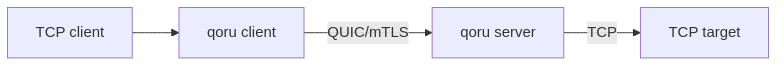
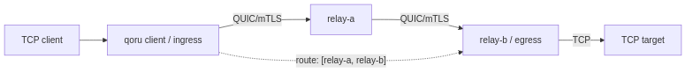
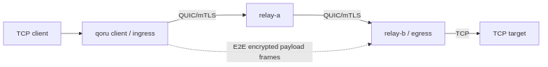

# qoru

`qoru` is an experimental QUIC-based network relay/proxy, written in Go.  The name is not meaningful.

The long-term goal is to create a small authenticated relay overlay where clients and relay nodes can forward traffic across one or more hops while preserving end-to-end payload confidentiality from intermediary relays.

The current implementation supports TCP forwarding over QUIC/mTLS, including direct one-hop forwarding and explicit-route multi-hop forwarding through configured relay peers.

## Topologies

The Mermaid sources for these rendered diagrams are in `docs/diagrams/`. Regenerate the PNGs with `make diagrams`.

### Direct one-hop forwarding



[Mermaid source](docs/diagrams/direct-one-hop.mmd)

### Explicit multi-hop forwarding



[Mermaid source](docs/diagrams/explicit-multihop.mmd)

### End-to-end encrypted payloads over relays



[Mermaid source](docs/diagrams/e2e-over-relays.mmd)

QUIC/mTLS authenticates and encrypts each adjacent hop. When E2E mode is enabled, TCP payload bytes are additionally encrypted from the ingress client to the egress service node so intermediary relays only forward opaque E2E frames.

## Current Features

- Go CLI using Cobra.
- YAML configuration.
- QUIC transport using `quic-go`.
- mTLS peer authentication with a configured private CA.
- Custom binary control protocol with UUIDv7 request IDs and machine-readable connect response codes.
- One reconnecting upstream QUIC connection per configured client-side server.
- Multiple direct upstream servers selected by forward `egress`.
- On-demand upstream reconnect for new local TCP connections after a QUIC connection loss.
- One QUIC stream per proxied TCP connection.
- Multiple local TCP forwards.
- Named TCP services on the server.
- Per-service peer authorization.
- Explicit relay ingress authorization with `allowed_relay_clients`.
- Optional one-hop egress selection.
- Explicit-route multi-hop TCP forwarding using configured relay peers.
- Startup dialing, inbound session registration, and connection reuse for configured relay peers.
- Server-side TCP target dialing and half-close-aware byte proxying.
- Optional required end-to-end encrypted TCP payload mode using service identity certificates.
- SPIFFE-style URI SAN node identities in mTLS certificates.
- Development certificate generation.
- Local echo-server demos and automated one-hop, two-hop, three-hop, and encrypted E2E smoke tests.

## Quick Start: Local Demo

Run all automated local smoke tests:

```sh
make demo-all
```

Or run individual smoke tests:

```sh
make demo-e2e
make demo-multihop
make demo-threehop
make demo-e2e-auto-direct
make demo-e2e-encrypted
```

Or run the one-hop demo manually.

Generate development certificates:

```sh
make gen-dev-certs
```

Start a local TCP echo target:

```sh
go run ./dev/echo-server -listen 127.0.0.1:9000
```

In another terminal, start the qoru server:

```sh
go run ./cmd/qoru server -c examples/config/server.yaml
```

In another terminal, start the qoru client:

```sh
go run ./cmd/qoru client -c examples/config/client.yaml
```

Then connect through the local qoru client listener:

```sh
nc 127.0.0.1 15432
```

Text typed into `nc` should be echoed back through:

```text
nc -> qoru client -> QUIC/mTLS -> qoru server -> echo server
```

See `docs/local-demo.md` for more details.

## Build and Test

Run the normal development gate:

```sh
make check
```

Or run individual checks:

```sh
make test
make build
make race
```

`make race` runs Go's race detector on the concurrency-heavy runtime/protocol packages.

The binary is written to:

```text
build/qoru
```

## CLI

```sh
qoru client -c examples/config/client.yaml
qoru server -c examples/config/server.yaml
qoru print-config -c examples/config/client.yaml
```

If `--config` is omitted, qoru checks:

```text
./qoru.yaml
./qoru.yml
/etc/qoru/config.yaml
/etc/qoru/config.yml
```

## Example Configuration

Client:

```yaml
node_id: client-1
mode: client

identity:
  cert: ./dev/certs/client-1.crt
  key: ./dev/certs/client-1.key
  ca: ./dev/certs/ca.crt

servers:
  - id: server-1
    address: 127.0.0.1:4433

forwards:
  - protocol: tcp
    listen: 127.0.0.1:15432
    service: echo
    egress: server-1
```

A forward may also set end-to-end payload encryption policy for a service with a configured service identity certificate. Valid values are `off`, `auto`, and `always`; `auto` encrypts relayed routes and skips E2E frame encryption for direct one-hop traffic:

```yaml
service_identity:
  ca: ./dev/certs/service-ca.crt

forwards:
  - protocol: tcp
    listen: 127.0.0.1:15432
    service: echo
    egress: server-1
    e2e: auto
```

When E2E is required by the selected forward/route, the egress service must configure `services[].e2e`. Plaintext routed requests to a service with `services[].e2e` are rejected.

A forward may also include an explicit `route`. The first hop must be a configured direct upstream server, and the final hop is the egress node:

```yaml
forwards:
  - protocol: tcp
    listen: 127.0.0.1:15432
    service: echo
    egress: relay-b
    route:
      - relay-a
      - relay-b
```

Explicit multi-hop routing currently supports routes up to three relay hops and uses hop-by-hop QUIC/mTLS. For services configured with service identity certificates and client forwards with `e2e: auto` or `e2e: always`, relayed TCP payloads are encrypted end-to-end between ingress client and egress service node; intermediary relays only forward opaque E2E frames. `e2e: auto` skips E2E frame encryption for direct one-hop traffic.

A client can configure multiple direct upstream servers. Without an explicit `route`, each forward must set `egress` to a configured server ID:

```yaml
servers:
  - id: server-1
    address: 127.0.0.1:4433
  - id: server-2
    address: 127.0.0.1:4434
```

One-hop server:

```yaml
node_id: server-1
mode: server

identity:
  cert: ./dev/certs/server-1.crt
  key: ./dev/certs/server-1.key
  ca: ./dev/certs/ca.crt

listen: 127.0.0.1:4433

services:
  - name: echo
    protocol: tcp
    target: 127.0.0.1:9000
    peers:
      - client-1
```

E2E-enabled service:

```yaml
service_identity:
  ca: ./dev/certs/service-ca.crt

services:
  - name: echo
    protocol: tcp
    target: 127.0.0.1:9000
    peers:
      - client-1
    e2e:
      cert: ./dev/certs/relay-b-echo.crt
      key: ./dev/certs/relay-b-echo.key
```

Relay peer config for explicit multi-hop forwarding:

```yaml
node_id: relay-a
mode: server

identity:
  cert: ./dev/certs/relay-a.crt
  key: ./dev/certs/relay-a.key
  ca: ./dev/certs/ca.crt

listen: 127.0.0.1:4433

allowed_relay_clients:
  - client-1

peers:
  - id: relay-b
    address: 127.0.0.1:4434
    dial: true
```

Relay authorization has two separate controls:

- `allowed_relay_clients` authorizes authenticated nodes that may use this node as an intermediate relay.
- top-level `peers` defines relay neighbors. When a routed request reaches its egress node, the previous-hop relay must be listed here.

For a two-hop route such as:

```text
client-1 -> relay-a -> relay-b -> echo
```

`relay-a` must authorize the ingress client:

```yaml
allowed_relay_clients:
  - client-1
```

`relay-b` must list `relay-a` as a relay peer, without dialing back:

```yaml
peers:
  - id: relay-a
```

For a three-hop route, the middle relay must do both:

```yaml
allowed_relay_clients:
  - relay-a

peers:
  - id: relay-a
  - id: relay-c
    address: 127.0.0.1:4435
    dial: true
```

## Security Model

`qoru` is intended to use two security layers:

```text
Application payload encryption  = end-to-end, ingress -> egress
QUIC mTLS                        = hop-by-hop, peer -> peer
```

The current implementation has QUIC/mTLS hop-by-hop encryption and authentication. It also supports required end-to-end encrypted TCP payload mode for configured services: the egress proves service identity, the ingress proves original client node identity, and payload bytes are carried in encrypted E2E frames. Plaintext routed access to a service configured with `services[].e2e` is rejected; direct one-hop plaintext remains available for `e2e: auto` topologies.

Relay authorization is explicit for routed traffic. Intermediate relays require the authenticated previous hop to be listed in `allowed_relay_clients`; routed egress nodes require the previous-hop relay to be listed in top-level `peers`. Final service access is still controlled separately by each service's `peers` allowlist. If a service's `peers` list is omitted or empty, any authenticated peer may use that service.

If the client-side upstream QUIC connection is lost, active proxied TCP connections on that connection are closed. The qoru client keeps its local listeners running and reconnects on demand for later local TCP connections. Failed reconnect dials use exponential backoff: `500ms`, `1s`, `2s`, `4s`, `8s`, `16s`, capped at `16s`. During backoff, new local TCP connections fail fast without qoru writing diagnostic bytes into the TCP stream.

Server QUIC listener accept failures are retried with exponential backoff starting at `100ms`, capped at `30s`, and reset after a successful accept.

For every direct peer path, including each hop in a multi-hop route:

```text
qoru node ==QUIC/mTLS== qoru node
```

mTLS uses certificates signed by the configured CA. The system trust store is not used. qoru node identity is taken from SPIFFE-style URI SANs such as:

```text
spiffe://qoru/node/client-1
spiffe://qoru/node/server-1
```

## Roadmap

Near-term:

- Improve service dial failure behavior for local TCP clients.
- Add better reconnect observability and clearer server-side session handling.
- Improve duplicate peer-session diagnostics and validation where possible.
- Add richer service selection semantics for future multi-egress/load-balanced service routing.
- Improve peer/session operational observability.

Longer-term:

- Broader E2E operational hardening and policy controls.
- UDP support.
- Topology/status commands.
- More complete direction-independent peer/session behavior.

## Documentation

```text
docs/design.md
docs/local-demo.md
docs/archive/design-discussion1.md
```

Example multi-hop and encrypted configs:

```text
examples/config/client-multihop.yaml
examples/config/client-threehop.yaml
examples/config/client-encrypted-multihop.yaml
examples/config/client-e2e-routes.yaml
examples/config/relay-a.yaml
examples/config/relay-a-e2e-routes.yaml
examples/config/relay-b.yaml
examples/config/relay-b-encrypted.yaml
examples/config/relay-b-threehop.yaml
examples/config/relay-c.yaml
examples/config/relay-c-encrypted.yaml
```

Server/relay configs use `peers` for relay neighbors; client configs use `servers` for direct upstream entry points. For routed egress traffic, the previous-hop relay must be listed in top-level `peers`. For intermediate relay forwarding, the previous hop must be listed in `allowed_relay_clients`; if this list is omitted or empty, any authenticated node may use that server as an intermediate relay. For now, configure `dial: true` on only one side of a peer relationship. The other side should list the peer without `dial` or with `dial: false` to accept/register inbound sessions. Dialing peers reconnect forever with capped exponential backoff. Mutual dialing is unsupported; duplicate peer sessions are logged and closed with the first live session winning.

## Status

Experimental. The current code supports one-hop and explicit-route multi-hop TCP forwarding over QUIC/mTLS. APIs, config, and protocol details are expected to change.
